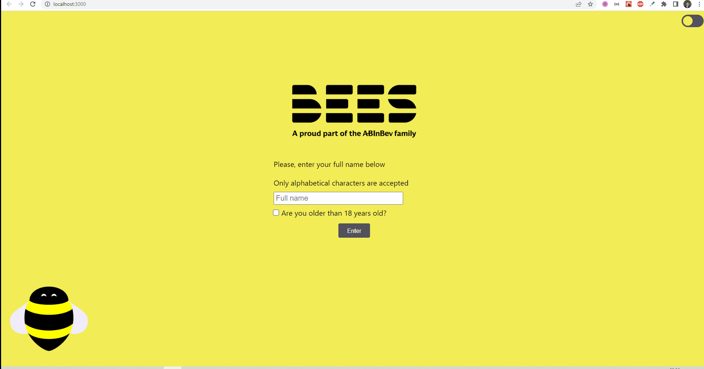

<p align="center">
  <a href="" rel="noopener">
 </a>
</p>

<h3 align="center">BEES Aplication</h3>

---

## :wink: About <a name = "about"></a>

<p align="justify" > 
The main goal of this project is to bring real-life daily basis jobs. The application consistis on a simple system that
will display data fetched from a 
  <a href="https://www.openbrewerydb.org/documentation" target="_blank">
public API
  </a>. 
</p>
--
## :pencil: Table of Contents

- [About](#about)
- [Getting Started](#getting_started)
- [Features](#features)
- [Built Using](#built_using)
- [Authors](#author)

---

## :checkered_flag: Getting Started <a name = "getting_started"></a>

These instructions will get you a copy of the project up and running on your local machine for development and testing purposes.
To clone and run this application, you'll need [Git](https://git-scm.com), [Node.js v17.8.0][nodejs] or higher + [Yarn v1.22.15][yarn] or higher installed on your computer.
From your command line:

```bash
# Clone this repository
$ git clone https://github.com/BrenoMaia98/BEES-project

# Go into the repository
$ cd BEES-project

# Install dependencies
$ yarn

# Run the app
$ yarn start
```



---

## :wrench: Running the tests <a name = "tests"></a>

To run the automated tests, you only need to use the command line with:

```
# Install dependencies (if you haven't already)
$ yarn

# To run all the app test at once
$ yarn test

# To run a specific test, choose a file under __test__ folder.
# E.g: file .spec extension
$ yarn jest fileName.spec
```

---

## :rocket: Features <a name = "features"></a>

- Dark theme available.

#### Home Page

- Full name and age confirmation required to login.
- Validation of alphabetical characters and minimum length of both first and last names.
- Enter button will always be enabled in order to show errors about wrong input values.

#### Breweries Page

- User name is displayed on header.
- The user can return to Home Page only by pressing "Go back" on application header, to prevent accidental logouts.
- Breweries data are fetched from this [public API][public api].
- Each Brewery fetched is displayed as a **Brewery Card**.

  ##### Brewery Card

  - Includes remove option that locally removes card from the list.
  - Some Brewery info are displayed as tags.
  - Includes phone number formatting.
  - Includes Tag "**Add more**" that locally add more information to this brewery.

    ##### Tag Add More

    - When clicked - it shows a text input to enter any information you want.
    - When pressed "Enter" or clicked outside the input, the text you typed will be tranformed into a **removeable tag**.

## :hammer: Built Using <a name = "built_using"></a>

- **[Eslint][eslint]** - Analyses and fix code problems statically, following clean code principles.
- **[Prettier][prettier]** - Automatic code formatter.
- **[Typescript][typescript]** - Strongly typed programming language that builds on JavaScript.
- **[React Dom Router][routerdom]** - Provides management of routes.
- **[Styled Components][styled-components]** - Library that allow you to write CSS-in-JS.
- **[Context API][contextapi]** and **[useReducer][usereducer]** - Both allow a simple state management.
- **[Axios][axios]** - Provides a promise-based HTTP client.
- **[Jest][jest]** - Testing framework for JS.
- **[React Testing Library][testing-library]** - Testing framework for React components behavior.

## :grinning: Author <a name = "author"></a>

Made with :heart: by Breno Maia :wave: [Get in touch!](https://www.linkedin.com/in/breno-sm-cruz/)

[yarn]: https://yarnpkg.com/
[nodejs]: https://nodejs.org/
[public api]: https://www.openbrewerydb.org/documentation
[eslint]: https://eslint.org/
[prettier]: https://prettier.io/
[typescript]: https://www.typescriptlang.org/docs/
[routerdom]: https://v5.reactrouter.com/web/guides/quick-start
[styled-components]: https://styled-components.com/
[contextapi]: https://pt-br.reactjs.org/docs/context.html
[usereducer]: https://pt-br.reactjs.org/docs/hooks-reference.html#usereducer
[axios]: https://axios-http.com/ptbr/docs/intro
[jest]: https://jestjs.io/
[testing-library]: https://testing-library.com/docs/react-testing-library/intro/
